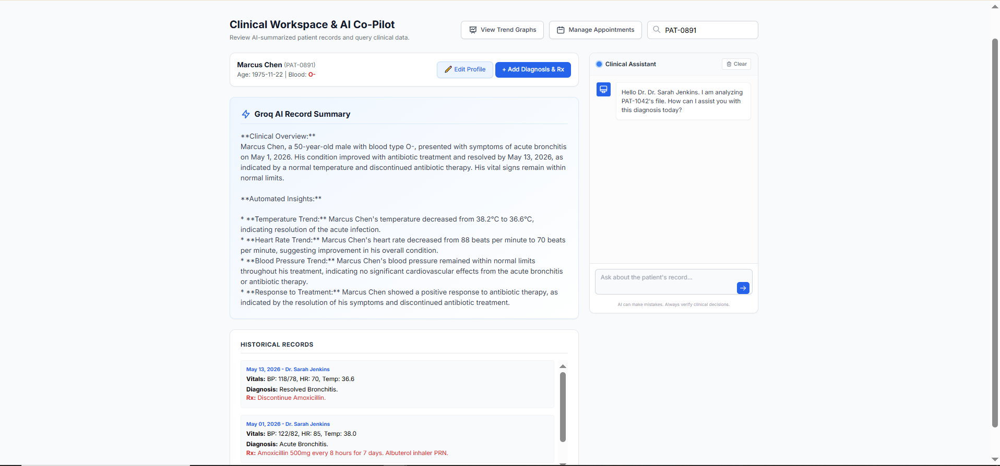
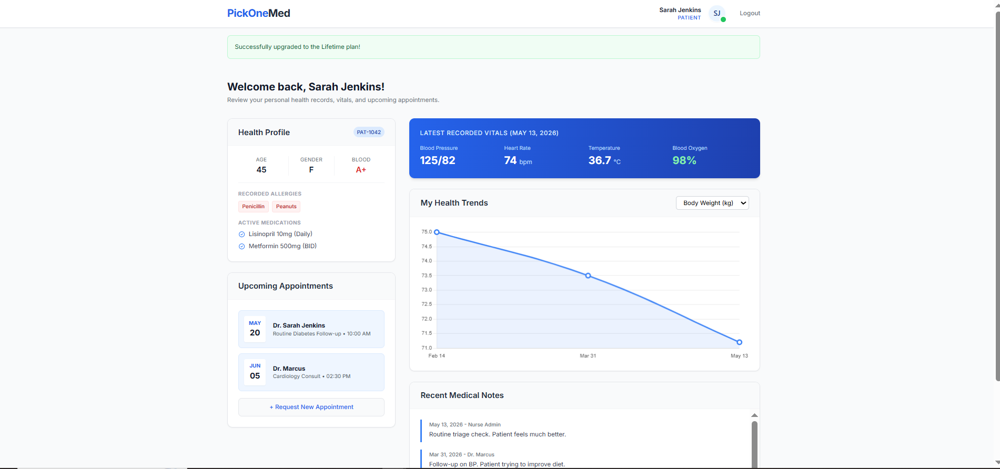
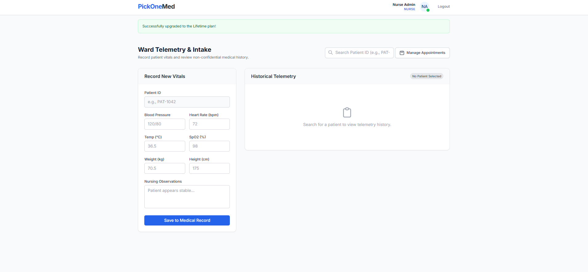
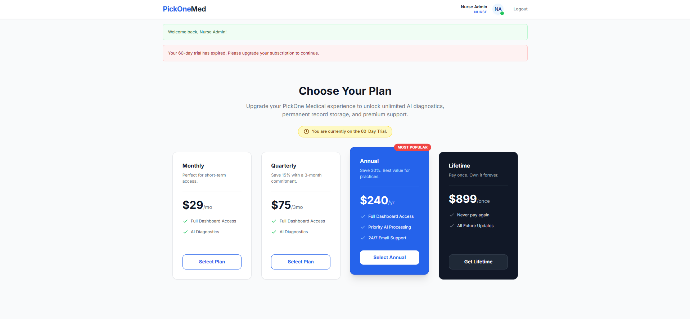

# PickOne Medical 🏥🤖

An AI-powered, role-based clinical workspace and patient portal built with Flask, Tailwind CSS, and the Groq API. PickOne Medical bridges the gap between patient experience and clinical efficiency by providing specialized dashboards for Doctors, Nurses, and Patients, enhanced by real-time AI medical summaries and interactive telemetry tracking.

**🚀 Live Demo:** [https://pickone-medical-981561318070.us-central1.run.app](https://pickone-medical-981561318070.us-central1.run.app)

## 🌟 Features

* **Role-Based Access Control:** Secure, isolated dashboards for Patients, Nurses, and Doctors.
* **AI Clinical Assistant (Powered by Groq & LLaMA 3):**
  * Automatically summarizes patient history and vitals.
  * Checks new prescriptions against medical history and allergies for drug interaction conflicts.
  * Persistent, context-aware chatbot for doctors to query patient records.
* **Interactive Telemetry Tracking:** Dynamic, visually rich charts powered by Chart.js for tracking blood pressure, heart rate, weight, and SpO2.
* **Appointment Management:** Patients can request appointments, and staff can approve or cancel them via a global management modal.
* **SaaS Ready:** Includes built-in trial periods, a pricing/tier upgrade page, and a support contact form.

---

## 📸 Screenshots

### Doctor Workspace & AI Co-Pilot

*Doctors can view AI summaries, interactive health trends, and consult the AI assistant for historical data.*

### Patient Portal

*Patients can view their latest vitals, request appointments, and track their personal health trends.*

### Nurse Triage & Intake

*Nurses can search for patients, log new vitals, and view historical telemetry data.*

### SaaS Pricing & Subscriptions

*Built-in subscription management for medical practices.*

---

## 🛠️ Technology Stack

* **Backend:** Python, Flask, Flask-Login, Flask-SQLAlchemy
* **Database:** SQLite (Relational Database)
* **Frontend:** HTML5, Tailwind CSS (via CDN), Jinja2 Templating
* **Data Visualization:** Chart.js
* **Artificial Intelligence:** Groq API (Model: `llama-3.1-8b-instant`)
* **Deployment:** Google Cloud Run

---